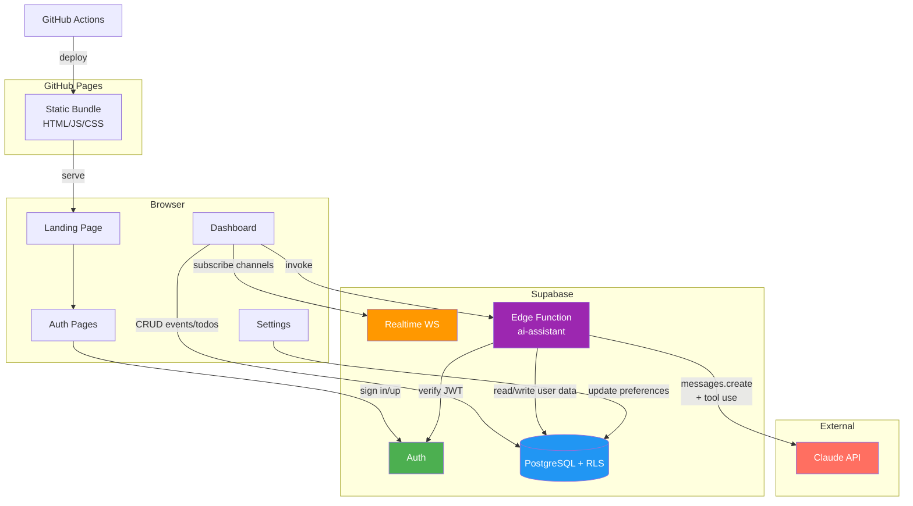
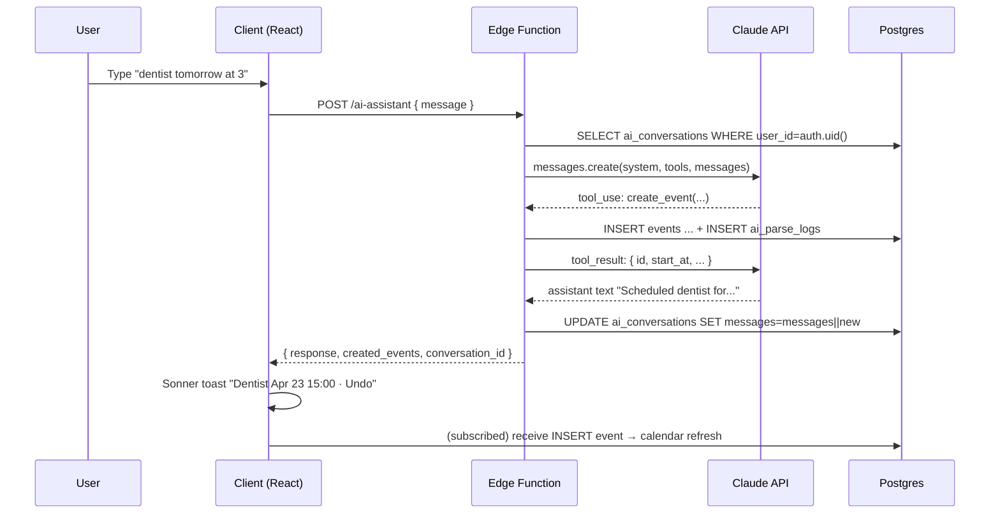
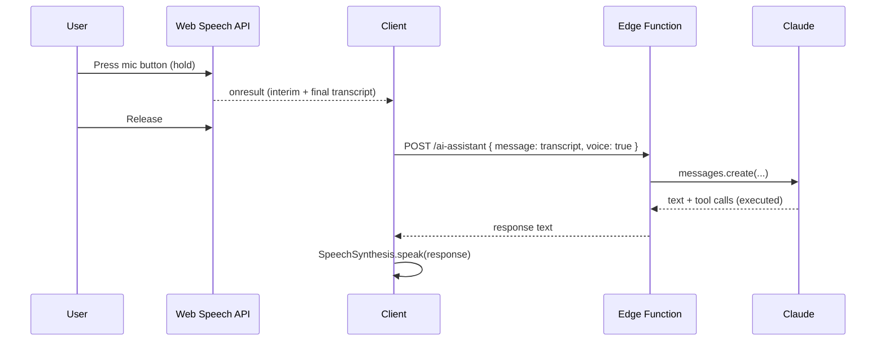
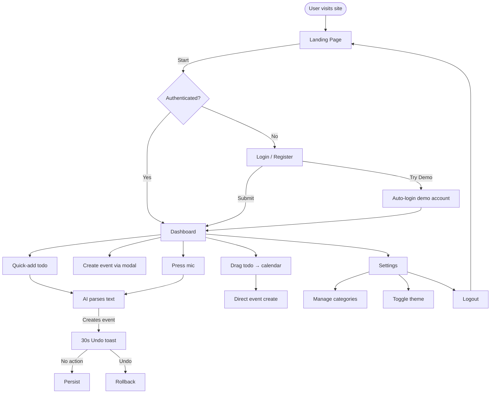
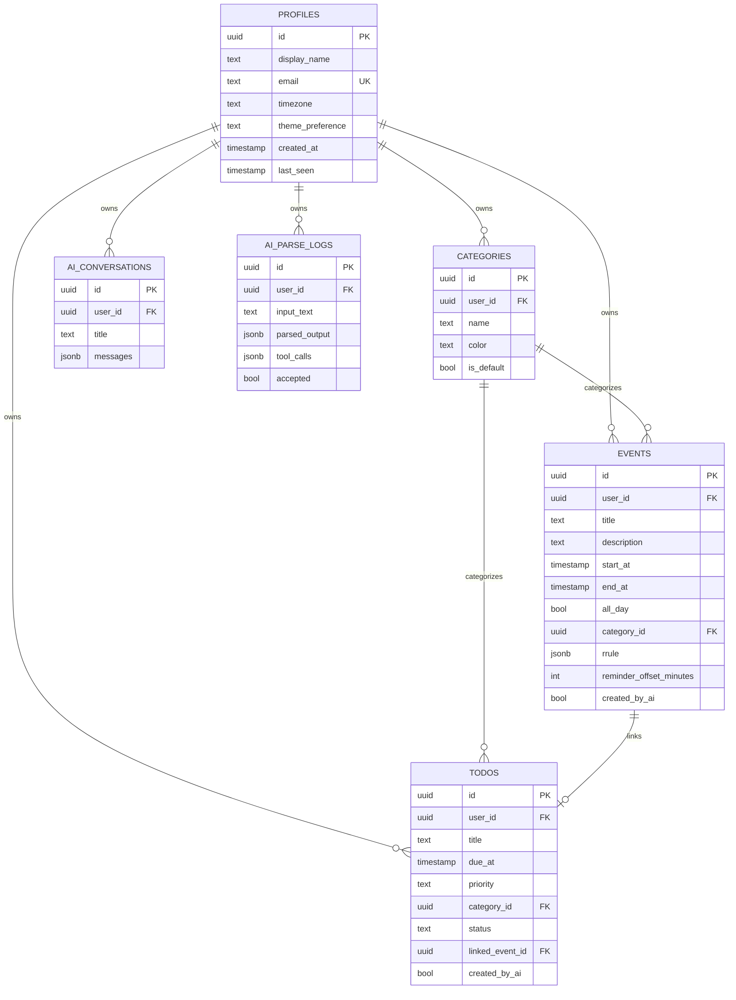
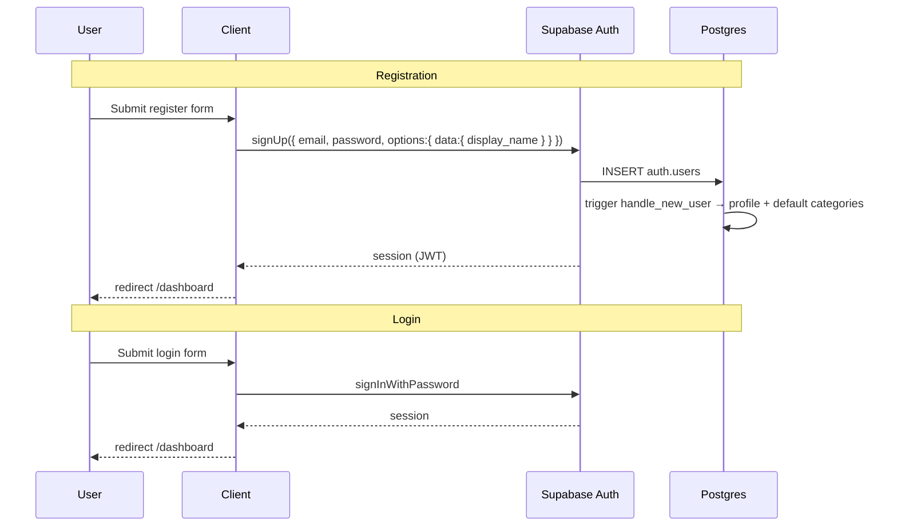
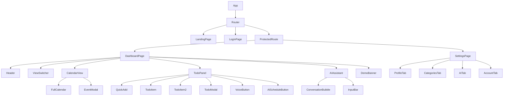

# CSC 710 — Dayforma

## Technical Design Document

**Version:** 1.0
**Date:** April 22, 2026
**Team:** Umut Çelik, Merve Gazi, Justin Huang
**Presentation:** May 13, 2026
**Submission:** May 20, 2026
**Course:** CSC 710 — Software Engineering
**Institution:** CUNY College of Staten Island

---

## Table of Contents

1. [Project Overview](#1-project-overview)
2. [Tech Stack](#2-tech-stack)
3. [System Architecture](#3-system-architecture)
4. [Application Flow](#4-application-flow)
5. [Page & Screen Specifications](#5-page--screen-specifications)
6. [Database Schema](#6-database-schema)
7. [Authentication System](#7-authentication-system)
8. [Todo Management](#8-todo-management)
9. [Calendar System](#9-calendar-system)
10. [AI Integration](#10-ai-integration)
11. [Realtime Sync](#11-realtime-sync)
12. [React Component Architecture](#12-react-component-architecture)
13. [API & Supabase Functions](#13-api--supabase-functions)
14. [Responsive Design](#14-responsive-design)
15. [CI/CD Pipeline](#15-cicd-pipeline)
16. [Security Considerations](#16-security-considerations)
17. [Error Handling & Edge Cases](#17-error-handling--edge-cases)
18. [Testing Strategy](#18-testing-strategy)
19. [Project Timeline & Milestones](#19-project-timeline--milestones)
20. [Future Enhancements](#20-future-enhancements)
- [Appendix A — Supabase Setup Checklist](#appendix-a--supabase-setup-checklist)
- [Appendix B — Local Development Setup](#appendix-b--local-development-setup)
- [Appendix C — Claude System Prompt & Tool Schemas](#appendix-c--claude-system-prompt--tool-schemas)
- [Appendix D — Final Report Template](#appendix-d--final-report-template)

---

## 1. Project Overview

### 1.1 Description

Dayforma is an AI-powered interactive calendar + todo web application. Each authenticated user
sees a dashboard split into two panels: a multi-view calendar on the left (Month / Week / Day /
Agenda) and a todo list on the right. A Claude-powered assistant, invoked through a Supabase
Edge Function, parses natural-language todos, auto-schedules them into free time, infers priority
and category, summarises the week, and accepts voice commands via the Web Speech API.

The v1 scope is deliberately single-user: every user's data is isolated through Supabase
Row-Level Security. Sharing, invitations, and team calendars are explicit future enhancements
(Section 20).

### 1.2 Core Features

| Feature | Description | Priority |
|---------|-------------|----------|
| Landing page | Public entry point with "Play Now"-style CTA | P0 |
| Authentication | Email/password via Supabase Auth | P0 |
| Demo account | "Try Demo" button seeded with sample data | P0 |
| Dashboard layout | Left calendar + right todo panel + header | P0 |
| Calendar views | Month, Week, Day, Agenda (FullCalendar v6) | P0 |
| Event CRUD | Create, edit, delete, move events | P0 |
| Todo CRUD | Create, edit, delete, mark done | P0 |
| Categories | User-managed categories with colour picker | P0 |
| Natural-language AI parse | Type "dentist tomorrow at 3" → AI proposes & creates event | P0 |
| 30s Undo toast | Sonner undo for every AI mutating action | P0 |
| Drag-drop todo → event | FullCalendar external drop | P0 |
| "Schedule with AI" button | Delegates free-time search + placement to Claude | P0 |
| Auto-scheduling | Claude `find_free_time` tool respects existing events | P1 |
| Priority / category inference | Claude tags new todos on save | P1 |
| Weekly summary | Claude-generated overview of events and todos | P1 |
| Voice commands | SpeechRecognition + SpeechSynthesis (Chrome/Edge only) | P1 |
| Simple recurrence | Daily / weekly / monthly / custom-weekdays presets | P1 |
| Browser notifications | `Notifications API` per event reminder offset | P1 |
| Theme toggle | `prefers-color-scheme` default + manual override | P1 |
| Realtime sync | Multi-tab / multi-device updates | P1 |
| Responsive layout | Mobile: agenda default + drawer todo panel | P1 |

### 1.3 Non-Functional Requirements

| Area | Requirement |
|------|-------------|
| **Performance** | Initial load ≤ 2 s on a typical laptop; interactions ≤ 100 ms p50 |
| **Accessibility** | Keyboard-only todo + event CRUD; `aria-live` for toasts; colour contrast AA |
| **Browser support** | Latest Chrome, Edge, Safari, Firefox (voice: Chrome/Edge only) |
| **Availability** | GitHub Pages + Supabase SLA (academic-grade uptime) |
| **Security** | Supabase RLS on every user table; Claude key never in browser |
| **Cost** | Free-tier Supabase + ≤ US $10 / month Claude spend during development |
| **Data privacy** | Each user's data isolated; no sharing in v1; no analytics beyond the AI parse log the user can clear |
| **Observability** | Supabase logs; Edge Function structured JSON logs; GitHub Actions build logs |

### 1.4 Out of Scope for v1 (moved to Future Enhancements)

- Multi-user sharing / invitations / team calendars
- Full RRULE recurrence (only four presets in v1)
- External calendar sync (Google, Outlook, iCloud)
- Mobile app (native or PWA install prompts)
- Email or SMS notifications
- Offline mode with conflict resolution
- Multi-language UI (English only in v1)
- Analytics dashboard for the user

---

## 2. Tech Stack

### 2.1 Technology Choices

```
┌─────────────────────────────────────────────────────────────┐
│                       TECH STACK                            │
├──────────────┬──────────────────────────────────────────────┤
│ Frontend     │ React 18 + Vite 6 + Tailwind v4             │
│ Router       │ React Router v7                              │
│ Calendar UI  │ FullCalendar v6 (daygrid/timegrid/list)      │
│ State        │ React Context + useReducer                   │
│ Forms        │ react-hook-form + zod                        │
│ Dates        │ date-fns v4                                  │
│ Toast        │ sonner                                       │
│ Icons        │ lucide-react                                 │
│ Language     │ TypeScript 5.8                               │
│ Backend      │ Supabase (Auth + Postgres + Realtime + Edge) │
│ AI           │ Claude (claude-sonnet-4-6) via Edge Function │
│ Voice        │ Web Speech API (Chrome/Edge)                 │
│ Testing      │ Vitest + React Testing Library + Playwright  │
│ Hosting      │ GitHub Pages (static)                        │
│ CI/CD        │ GitHub Actions                               │
└──────────────┴──────────────────────────────────────────────┘
```

### 2.2 Dependencies

| Package | Purpose |
|---------|---------|
| `react`, `react-dom` ^18.3.1 | UI framework |
| `react-router` ^7.13.0 | Client-side routing |
| `@supabase/supabase-js` ^2.57.4 | Backend SDK |
| `@fullcalendar/react` ^6.1.15 | Calendar component |
| `@fullcalendar/daygrid`, `timegrid`, `list`, `interaction` ^6.1.15 | Calendar views + drag-drop |
| `date-fns` ^4.1.0 | Date arithmetic |
| `react-hook-form` ^7.54.0 | Forms |
| `zod` ^3.24.0 | Validation (shared with Edge Function) |
| `sonner` ^1.7.0 | Toast notifications (incl. Undo pattern) |
| `lucide-react` | Icons |
| `tailwindcss` ^4.1.0 + `@tailwindcss/vite` ^4.1.0 | Styling |
| `vite` ^6.3.0, `@vitejs/plugin-react` ^4.5.0 | Build |
| `typescript` ^5.8.2 | Types |
| `vitest` ^3.0.5, `@testing-library/react` ^16.1.0, `jsdom` | Testing |

### 2.3 Supabase Services Used

| Service | Usage |
|---------|-------|
| **Auth** | Email/password registration and login |
| **Postgres** | All persistent data: profiles, events, todos, categories, AI logs |
| **Realtime** | `events`, `todos` updates broadcast to each user's tabs |
| **Edge Functions** | `ai-assistant` Deno function that talks to Claude |

### 2.4 AI Stack

| Component | Choice | Notes |
|-----------|--------|-------|
| Model | `claude-sonnet-4-6` | Latest Sonnet as of April 2026; strong tool-use + long context |
| SDK | `@anthropic-ai/sdk` (Deno import) | Edge Function uses `npm:@anthropic-ai/sdk` |
| Features used | Tool use + prompt caching | `cache_control: ephemeral` on system prompt + tool defs |
| Voice input | Web Speech API `SpeechRecognition` | Chrome/Edge only; warning in other browsers |
| Voice output | Web Speech API `SpeechSynthesis` | Native TTS; no external cost |

---

## 3. System Architecture

### 3.1 High-Level Architecture



### 3.2 Data Flow — Natural-Language Parse



### 3.3 Voice Flow



---

## 4. Application Flow

### 4.1 Complete User Journey



### 4.2 Demo Mode Flow

1. User clicks "Try Demo" on the login page.
2. Client calls `supabase.auth.signInWithPassword` with the credentials of the pre-provisioned
   `demo@dayforma.app` user (stored in-repo because this account is intentionally shared).
3. On first login the `handle_new_user` trigger already seeded three default categories; a
   Supabase edge function (or one-off SQL seed, pinned to the demo user's UUID) inserts a fixed
   set of sample events + todos.
4. Dashboard renders with data populated; a banner indicates "Demo mode — changes are shared".
5. Demo account allows edits but resets hourly via a scheduled job in Supabase (future
   enhancement — for v1, we simply re-seed manually before the presentation).

---

## 5. Page & Screen Specifications

### 5.1 Landing Page (`/`)

| Element | Description |
|---------|-------------|
| Hero | Dayforma wordmark + tagline "Shape your day." |
| CTA | Primary "Start" button → `/login` |
| Features | Three cards: "AI that plans with you", "Voice-first scheduling", "Undo anything" |
| Footer | Team credits + GitHub link + CSC 710 tag |

**Design:** Dark navy background (`bg-slate-950`), soft gradient highlights, subtle grid pattern,
`Inter` font. Button pulses gently on hover.

### 5.2 Authentication Pages

**Routes:** `/login` (toggles between Login and Register states)

| Mode | Fields |
|------|--------|
| **Login** | Email (required) · Password (required, ≥ 8 chars) |
| **Register** | Display Name (3–30 chars) · Email · Password · Confirm Password |

**Extras on Login screen:** "Try Demo" button (calls `signInWithPassword` with `demo@dayforma.app`);
"Forgot password?" link (Supabase magic link reset — v1 stretch goal).

**Validation:** zod schema; `react-hook-form` surfaces per-field errors; submit disabled while
invalid.

### 5.3 Dashboard (`/dashboard`)

```
┌──────────────────────────────────────────────────────────────────┐
│ Dayforma  ·  Dashboard          user@…  [🌙] [⚙] [↩]            │
├─────────────────────────────────────────────┬────────────────────┤
│                                             │  TODOS             │
│  [Month] [Week] [Day] [Agenda]  < Apr 2026> │  ┌──────────────┐  │
│                                             │  │ Quick add  ↵ │  │
│  ┌──────────────────────────────────────┐   │  └──────────────┘  │
│  │  FullCalendar (Month view)           │   │                    │
│  │  · 09:00 Standup                     │   │  ◎ Pay rent  [↗]   │
│  │  · 14:30 Dentist                     │   │  ◎ Report review   │
│  │  · 16:00 Study block                 │   │  ✓ Grocery         │
│  │  ...                                 │   │  ...               │
│  └──────────────────────────────────────┘   │                    │
│                                             │  [🎤] [✨ AI]      │
└─────────────────────────────────────────────┴────────────────────┘
```

- **Header:** logo, page title, theme toggle, settings link, logout
- **View switcher:** Month / Week / Day / Agenda tabs
- **Calendar area:** FullCalendar v6 with drag-drop from TodoPanel (external source)
- **Todo panel:** quick-add input (hits `/ai-assistant` on blur/enter), todo list with
  status toggle, priority dot, category colour chip
- **Footer on todo panel:** mic button (voice) and "✨ Schedule with AI" button

### 5.4 Event Detail Modal

Opens on event click or after a successful create. Fields:
- Title (required)
- Description (optional, long text)
- Start / End (date + time pickers; respects all-day toggle)
- All-day toggle
- Category (dropdown with colour dots)
- Recurrence preset (None / Daily / Weekly / Monthly / Weekday)
- Reminder offset (None / 5m / 15m / 30m / 1h / 1d)

Actions: Save · Delete · Close.

### 5.5 Todo Detail Modal

Fields: Title · Description · Due at · Priority (low/medium/high/urgent) · Category · Status.
Actions: Save · Delete · "Schedule with AI" · Close.

### 5.6 AI Assistant Panel

Shown at the bottom-right of the dashboard as a slide-out drawer (mobile: full-screen sheet).
Shows the last 20 turns of the conversation + input field + mic button. Each turn block lists
the user message, the assistant's reply, and compact cards for any tool calls (e.g. "Created
event: Dentist · Apr 23 15:00").

### 5.7 Settings (`/settings`)

Tabs:
1. **Profile** — display name, email (read-only), timezone (auto-detected, editable),
   theme preference
2. **Categories** — list with colour swatches; create / rename / recolour / delete
3. **AI** — list of recent `ai_conversations`; ability to clear history
4. **Account** — change password, delete account (cascades via FK)

### 5.8 Profile (inline on Settings)

Display name, avatar URL (v2), member-since, totals (events count, todos count, AI actions count).

### 5.9 Mobile Layouts

- Viewport < 768 px: todo panel becomes a bottom sheet drawer; FAB bottom-right opens AI assistant.
- Calendar view defaults to **Agenda** on mobile.
- Mic + AI buttons are always visible on the bottom bar.

---

## 6. Database Schema

### 6.1 Entity Relationship Diagram



### 6.2 Table Definitions

Schema + Row-Level Security + triggers live in
[`supabase/migrations/001_initial_schema.sql`](./supabase/migrations/001_initial_schema.sql). The
full SQL appears in Section 6.3. Highlights per table:

- `profiles` — primary key is `auth.users.id`; `handle_new_user` trigger inserts the row on
  signup and seeds the three default categories `Work`, `Personal`, `Health`.
- `categories` — unique `(user_id, name)` so each user has at most one "Work" category. RLS
  ensures no cross-user reads.
- `events` — `end_at >= start_at` constraint; `rrule` is a JSON object like
  `{ "preset": "weekly", "weekdays": [1,3] }` for v1. Indexed by `(user_id, start_at)` to keep
  calendar range queries cheap.
- `todos` — `UNIQUE (linked_event_id)` enforces the 1-to-1 todo↔event link. `priority` and
  `status` are CHECK-constrained enums.
- `ai_conversations` — `messages` JSONB is an ordered array of `{ role, content, tool_use?,
  tool_result? }` objects. Size kept bounded by trimming to the last 50 turns before persisting.
- `ai_parse_logs` — append-only audit trail; useful during sprint 2/3 debugging and for Testing
  Section 18.

### 6.3 SQL Migration Script

The canonical migration lives at `supabase/migrations/001_initial_schema.sql`. Key excerpts:

```sql
-- Events + RLS
CREATE TABLE events (
    id UUID PRIMARY KEY DEFAULT gen_random_uuid(),
    user_id UUID NOT NULL REFERENCES profiles(id) ON DELETE CASCADE,
    title TEXT NOT NULL,
    description TEXT,
    start_at TIMESTAMPTZ NOT NULL,
    end_at TIMESTAMPTZ NOT NULL,
    all_day BOOLEAN DEFAULT false,
    category_id UUID REFERENCES categories(id) ON DELETE SET NULL,
    rrule JSONB,
    reminder_offset_minutes INTEGER,
    created_by_ai BOOLEAN DEFAULT false,
    created_at TIMESTAMPTZ DEFAULT now(),
    updated_at TIMESTAMPTZ DEFAULT now(),
    CHECK (end_at >= start_at)
);
ALTER TABLE events ENABLE ROW LEVEL SECURITY;
CREATE POLICY "events_select_own" ON events FOR SELECT USING (auth.uid() = user_id);
CREATE POLICY "events_insert_own" ON events FOR INSERT WITH CHECK (auth.uid() = user_id);
CREATE POLICY "events_update_own" ON events FOR UPDATE USING (auth.uid() = user_id);
CREATE POLICY "events_delete_own" ON events FOR DELETE USING (auth.uid() = user_id);
```

The migration also:
- enables `uuid-ossp`
- creates `handle_new_user` (profile + default categories seed)
- creates `set_updated_at` trigger used by `events`, `todos`, `ai_conversations`
- registers `events` and `todos` with the `supabase_realtime` publication

### 6.4 Row-Level Security

Every user-scoped table enforces `user_id = auth.uid()` on SELECT, INSERT (via `WITH CHECK`),
UPDATE, and DELETE. The Edge Function calls Supabase with the user's JWT, so the same RLS
applies to server-side writes — we never rely on a service-role key for user data.

### 6.5 Demo Seed

A separate idempotent seed script (`supabase/seed/demo.sql`, to be written in Sprint 2) populates
the demo account with:
- Three categories (already present via trigger)
- Six events distributed across the current week
- Five pending todos with varying priorities
- One completed todo
- One pre-baked AI conversation showing a sample interaction

The seed runs via `supabase db execute` before the presentation.

---

## 7. Authentication System

### 7.1 Auth Flow



### 7.2 AuthContext

```ts
interface AuthContextValue {
  user: User | null;
  profile: Profile | null;
  loading: boolean;
  signIn: (email: string, password: string) => Promise<void>;
  signUp: (email: string, password: string, displayName: string) => Promise<void>;
  signInDemo: () => Promise<void>;
  signOut: () => Promise<void>;
}
```

Exposed via `useAuth()`. On mount it:
1. Fetches the active session.
2. Subscribes to `supabase.auth.onAuthStateChange` to keep `user` in sync.
3. Lazy-loads the matching row in `profiles` into `profile`.

### 7.3 ProtectedRoute

```tsx
function ProtectedRoute({ children }: { children: ReactNode }) {
  const { user, loading } = useAuth();
  if (loading) return <Spinner />;
  if (!user) return <Navigate to="/login" replace />;
  return children;
}
```

### 7.4 Demo Account

- Pre-provisioned: `demo@dayforma.app` / password in a team-only secret.
- `signInDemo()` calls `signInWithPassword` with those credentials.
- Displays a persistent `<DemoBanner>` warning that the account resets.

---

## 8. Todo Management

### 8.1 TodoContext + Reducer

```ts
type TodoAction =
  | { type: "set"; todos: Todo[] }
  | { type: "add"; todo: Todo }
  | { type: "update"; todo: Todo }
  | { type: "remove"; id: string };

function todoReducer(state: Todo[], action: TodoAction): Todo[] { ... }
```

`TodoProvider` fetches initial data, subscribes to the realtime `todos` channel, and dispatches
reducer actions on every event.

### 8.2 CRUD Operations

- **Create:** quick-add input (`Enter` submits) or full modal. On submit, calls the Edge
  Function if AI parsing is desired, else writes directly via `supabase.from("todos").insert`.
- **Read:** paginated by status (unbounded for now, since volumes are small for a student
  workload).
- **Update:** inline edits (double-click title) and full modal. Status toggle is one click.
- **Delete:** soft-confirm via toast "Removed · Undo".

### 8.3 Filtering & Sorting

- Filters: status (all / pending / scheduled / done), category, date range.
- Sort: due date asc (default), priority desc, created desc.
- All client-side for v1 — data volumes do not warrant server-side pagination.

### 8.4 Quick-Add Behaviour

The quick-add input accepts plain text. On submit:
1. Optimistically insert a `pending` todo with the raw text as title.
2. Fire a debounced call to the Edge Function asking Claude to extract
   `{ title, due_at?, priority?, category? }`.
3. Patch the todo with the inferred fields; flash a subtle highlight.
4. If Claude also creates an event (user wrote a time), 30-second Undo toast appears.

---

## 9. Calendar System

### 9.1 FullCalendar Integration

`<CalendarView>` wraps `<FullCalendar />` with the plugins `daygrid`, `timegrid`, `list`, and
`interaction`. Props:
- `events` — merged view of `events` + linked todos (as distinct event colouring)
- `initialView` — `dayGridMonth` on desktop, `listWeek` on mobile
- `editable` — true (drag to move, resize)
- `droppable` — true (accepts drops from the todo panel)
- `headerToolbar` — view switcher + prev/next/today

### 9.2 View Switcher

A controlled tab bar sets `currentView` in local state and calls the imperative FullCalendar API
`calendarApi.changeView(view)`. State persists in `localStorage` so the next visit opens on the
same view.

### 9.3 Event CRUD

- **Create:** click on an empty slot (day view / time grid) → opens `<EventModal>`.
- **Edit:** click on an event chip → opens the same modal pre-filled.
- **Move / resize:** drag → `eventDrop` / `eventResize` handlers patch the DB.
- **Delete:** modal delete button + keyboard `Del` on a focused event.

### 9.4 Drag-Drop Todo → Event

Todo items in the panel are wrapped with `draggable`. When dropped on the calendar,
FullCalendar's `drop` callback fires with the target date; the client posts to the Edge
Function with `{ intent: "schedule", todo_id, drop_target }` so Claude can decide the best
`end_at` based on recent durations, or the client falls back to a default 1-hour slot if the
user explicitly holds `Shift` to skip AI.

### 9.5 Recurring Events (simple presets)

v1 stores `rrule` as a JSON preset object:
- `{ preset: "daily" }`
- `{ preset: "weekly", weekdays: [1,3] }` (0 = Sunday)
- `{ preset: "monthly", day_of_month: 15 }`
- `{ preset: "weekday" }` — i.e. Mon–Fri

A utility in `src/lib/rrule-helpers.ts` expands an event into concrete instances within the
current viewport, which FullCalendar then renders. Editing a single instance stores an
`exception` list in the parent event's `rrule` object ("skip this date"); editing "this and
future" creates a new event record starting from that date.

### 9.6 Timezone Handling

- DB stores UTC.
- Client reads the browser timezone via `Intl.DateTimeFormat().resolvedOptions().timeZone` and
  writes it to `profiles.timezone` on first login.
- All display conversions use `date-fns-tz` (optional future dep) or direct `Date` APIs with
  `toLocaleString` for v1.

---

## 10. AI Integration

### 10.1 Architecture

```
Browser  ──POST /ai-assistant──▶  Edge Function (Deno)
                                    ├─ verify Supabase JWT
                                    ├─ load ai_conversations[user]
                                    ├─ call Claude API (with tools, cached system prompt)
                                    ├─ loop until Claude stops tool-calling
                                    │   ├─ create_event → INSERT events
                                    │   ├─ update_event → UPDATE events
                                    │   ├─ delete_event → DELETE events
                                    │   ├─ create_todo  → INSERT todos
                                    │   ├─ find_free_time → read events, compute gaps
                                    │   ├─ list_events  → SELECT events
                                    │   └─ summarize_week → aggregate + templated prose
                                    ├─ persist updated conversation
                                    └─ return { text, tool_calls, conversation_id }
```

### 10.2 System Prompt Design

The system prompt (full text in Appendix C) includes:
- Role: "You are Dayforma, a calendar and todo assistant."
- User context placeholder: `{{user_display_name}}`, `{{timezone}}`, `{{now_iso}}`,
  `{{weekly_snapshot}}` injected per request.
- Behavioural rules: default working hours, avoid collisions unless asked, clarify ambiguous
  references (today vs tomorrow across midnight).
- Output contract: call exactly one tool per turn; explain what you did in ≤ 2 sentences.

The prompt carries `cache_control: { type: "ephemeral" }` so it hits the 5-minute prompt cache
across back-to-back requests from the same user.

### 10.3 Tool Definitions

Full JSON schemas in Appendix C. Summary:

| Tool | Purpose |
|------|---------|
| `create_event` | Title, start, end, all_day, category_name, reminder_offset_minutes |
| `update_event` | event_id + partial fields |
| `delete_event` | event_id |
| `create_todo` | Title, due_at, priority, category_name, auto_schedule bool |
| `find_free_time` | duration_minutes, search_from, search_to, preferences (working hours, avoid evenings, etc.) |
| `list_events` | range_start, range_end |
| `summarize_week` | start_of_week (ISO), returns markdown summary |

### 10.4 Natural-Language Parse — Example

**User:** `lunch with mom next tuesday noon`

**Claude tool call:** `create_event(title="Lunch with Mom", start_at="2026-04-28T12:00:00Z",
end_at="2026-04-28T13:00:00Z", category_name="Personal")`

**Assistant text:** `Scheduled "Lunch with Mom" for Tue Apr 28 at 12 p.m.`

### 10.5 Auto-Scheduling Algorithm

`find_free_time` receives a range and a duration. The Edge Function:
1. Fetches all events in `[search_from, search_to]` for the user, sorted by `start_at`.
2. Subtracts events from the window, yielding a list of gaps.
3. Filters gaps by preferences (working hours, minimum buffer after the previous event, avoid
   evenings, minimum length ≥ required duration).
4. Returns the top three candidate slots ranked by proximity to the requested date and minimal
   calendar disruption.
5. Claude then decides which to pick or asks the user.

### 10.6 Priority / Category Inference

When the user quickly adds a todo without picking priority/category, the Edge Function asks
Claude (with a short, cached sub-prompt) to propose those fields. The response is a structured
JSON (not a tool call — cheaper) that the client applies as a patch.

### 10.7 Weekly Summary

The `summarize_week` tool reads events + todos for the given week and returns a markdown block:

> **Week of Apr 20–26**
>
> 4 events and 7 todos.
>
> - Heavy Tuesday (3 meetings).
> - Two todos overdue: "Submit assignment", "Call plumber".
> - Suggested focus block: Wednesday 10:00–12:00.

Rendered inside the AI assistant panel.

### 10.8 Voice Mode

- Client instantiates `new webkitSpeechRecognition() || SpeechRecognition()`.
- `interimResults = true` so the UI shows live transcripts.
- On final transcript, the client POSTs to the Edge Function with `voice: true`.
- The response is spoken via `window.speechSynthesis.speak(new SpeechSynthesisUtterance(text))`.
- On unsupported browsers, the mic button renders disabled with a tooltip "Voice requires
  Chrome or Edge".

### 10.9 Conversation Memory

- Each dashboard session opens (or continues) one `ai_conversations` row.
- Messages array is trimmed to the last 50 turns before persisting to cap row size.
- User can clear history in Settings → AI.

### 10.10 Prompt-Caching Strategy

- System prompt + tool definitions carry `cache_control: { type: "ephemeral" }` (~2 k tokens).
- Cache TTL is 5 minutes; user interactions typically land within that window, so the cache-hit
  rate is high during active use. Cost reduction per cached request: ~90 % on system tokens.

### 10.11 Semi-Autonomous Behaviour Rules

- If Claude is ≥ 90 % confident about a requested mutation, execute and show Undo toast.
- If ambiguous (e.g. "tomorrow" spanning midnight, multiple matching events), Claude emits a
  clarifying question and does not mutate.
- Destructive mutations (`delete_event` on ≥ 2 events, `update_event` to shift a recurring
  parent) always require explicit confirmation.

### 10.12 30-Second Undo Toast Implementation

```ts
async function applyWithUndo(action: Action) {
  const snapshot = await takeSnapshot(action);
  toast("Scheduled · Undo", {
    duration: 30000,
    action: { label: "Undo", onClick: () => restoreSnapshot(snapshot) }
  });
}
```

- For inserts: store the new row's id and call DELETE on Undo.
- For updates: store the prior row and UPSERT it on Undo.
- For deletes: soft-delete via a `deleted_at` column would be cleaner; for v1 we keep the prior
  row in memory and re-insert with a new id if Undo fires.

---

## 11. Realtime Sync

### 11.1 Channel Architecture

| Channel | Source | Purpose |
|---------|--------|---------|
| `realtime:events:user_id=eq.<uid>` | Postgres CDC on `events` | Multi-tab/multi-device event sync |
| `realtime:todos:user_id=eq.<uid>` | Postgres CDC on `todos` | Todo sync |

Both tables are added to the `supabase_realtime` publication by the migration. The browser
subscribes with `supabase.channel("events").on("postgres_changes", { event: "*", schema: "public",
table: "events", filter: "user_id=eq." + userId }, handler).subscribe()`.

### 11.2 Multi-Device Behaviour

Opening Dayforma on phone + laptop for the same user: any CRUD on one device triggers an INSERT /
UPDATE / DELETE event that the other device's reducer applies. Deduplication is based on row id —
local optimistic state is overwritten when the authoritative DB row arrives.

### 11.3 Subscription Lifecycle

- Subscribe on `TodoProvider` / `EventProvider` mount.
- Unsubscribe on unmount via `supabase.removeChannel(channel)`.
- Re-subscribe after session refresh if auth events change the user.

---

## 12. React Component Architecture

### 12.1 Component Tree



### 12.2 Key Component Specifications

- **`<CalendarView>`** — memoised around `events` array; recomputes when realtime pushes an
  update. Debounces scroll-driven range changes (avoid double-fetching events).
- **`<TodoPanel>`** — virtual list (react-window if counts exceed 200 in future); each todo row
  keyboard-focusable; drag handle on hover.
- **`<EventModal>`** — `react-hook-form` + zod resolver; trapped focus; Escape closes; Cmd+Enter
  submits.
- **`<AIAssistant>`** — controlled via `useAIAssistant()` hook. Streams partial text responses
  (if later we add streaming — v1 is non-streaming).
- **`<VoiceButton>`** — press-and-hold with visual waveform; fallback to tap-to-toggle; shows
  `aria-live` transcript.
- **`<ThemeToggle>`** — Writes `theme` to localStorage and toggles `<html data-theme="...">`;
  respects `prefers-color-scheme` when `theme === "system"`.
- **`<ProtectedRoute>`** — redirects unauthenticated users; renders spinner during session
  hydration.
- **`<DemoBanner>`** — visible only when `user.email === "demo@dayforma.app"`; includes "Sign
  out of demo" shortcut.

### 12.3 Source File Structure

See Section 2 of `CLAUDE.md` and the repo root `README.md`. Exact tree:

```
src/
├── main.tsx
├── App.tsx
├── contexts/
│   ├── AuthContext.tsx
│   ├── EventContext.tsx
│   ├── TodoContext.tsx
│   └── ThemeContext.tsx
├── hooks/
│   ├── useAuth.ts
│   ├── useEvents.ts
│   ├── useTodos.ts
│   ├── useAIAssistant.ts
│   └── useVoice.ts
├── pages/
│   ├── LandingPage.tsx
│   ├── LoginPage.tsx
│   ├── DashboardPage.tsx
│   └── SettingsPage.tsx
├── components/
│   ├── common/
│   │   ├── Button.tsx
│   │   ├── Input.tsx
│   │   ├── Modal.tsx
│   │   ├── ProtectedRoute.tsx
│   │   ├── ThemeToggle.tsx
│   │   └── DemoBanner.tsx
│   ├── dashboard/
│   │   ├── Dashboard.tsx
│   │   ├── Header.tsx
│   │   ├── ViewSwitcher.tsx
│   │   ├── TodoPanel.tsx
│   │   ├── TodoItem.tsx
│   │   ├── QuickAdd.tsx
│   │   └── TodoModal.tsx
│   ├── calendar/
│   │   ├── CalendarView.tsx
│   │   ├── EventModal.tsx
│   │   └── EventForm.tsx
│   ├── ai/
│   │   ├── AIAssistant.tsx
│   │   ├── VoiceButton.tsx
│   │   ├── ConversationBubble.tsx
│   │   └── AIScheduleButton.tsx
│   └── settings/
│       ├── Settings.tsx
│       ├── CategoryManager.tsx
│       ├── ProfileTab.tsx
│       ├── AITab.tsx
│       └── AccountTab.tsx
├── lib/
│   ├── supabase.ts
│   ├── date-utils.ts
│   ├── rrule-helpers.ts
│   └── constants.ts
├── types/
│   └── index.ts
└── styles/
    └── index.css

supabase/
├── migrations/
│   └── 001_initial_schema.sql
├── seed/
│   └── demo.sql
└── functions/
    └── ai-assistant/
        └── index.ts

tests/
├── setup.ts
├── unit/
├── integration/
└── e2e/
```

---

## 13. API & Supabase Functions

### 13.1 Supabase Client Setup

`src/lib/supabase.ts`:

```ts
import { createClient } from "@supabase/supabase-js";

const url = import.meta.env.VITE_SUPABASE_URL;
const key = import.meta.env.VITE_SUPABASE_PUBLISHABLE_KEY;
if (!url || !key) throw new Error("Missing Supabase env vars");

export const supabase = createClient(url, key);
```

The singleton is imported wherever DB access is needed; realtime channels are created lazily
inside context providers.

### 13.2 TypeScript Interfaces

`src/types/index.ts` (abridged):

```ts
export type UUID = string;

export interface Profile {
  id: UUID;
  display_name: string;
  email: string;
  timezone: string;
  theme_preference: "light" | "dark" | "system";
  created_at: string;
  last_seen: string;
}

export interface Category {
  id: UUID;
  user_id: UUID;
  name: string;
  color: string;
  is_default: boolean;
}

export type Priority = "low" | "medium" | "high" | "urgent";
export type TodoStatus = "pending" | "scheduled" | "done";

export interface Todo {
  id: UUID;
  user_id: UUID;
  title: string;
  description: string | null;
  due_at: string | null;
  priority: Priority;
  category_id: UUID | null;
  status: TodoStatus;
  linked_event_id: UUID | null;
  created_by_ai: boolean;
  created_at: string;
  updated_at: string;
}

export type RRulePreset =
  | { preset: "daily" }
  | { preset: "weekly"; weekdays: number[] }
  | { preset: "monthly"; day_of_month: number }
  | { preset: "weekday" };

export interface Event {
  id: UUID;
  user_id: UUID;
  title: string;
  description: string | null;
  start_at: string;
  end_at: string;
  all_day: boolean;
  category_id: UUID | null;
  rrule: RRulePreset | null;
  reminder_offset_minutes: number | null;
  created_by_ai: boolean;
  created_at: string;
  updated_at: string;
}

export interface AIConversationMessage {
  role: "user" | "assistant";
  content: string;
  tool_calls?: ToolCall[];
  tool_result?: unknown;
}

export interface ToolCall {
  name: string;
  input: Record<string, unknown>;
}
```

### 13.3 Shared zod Schemas

`src/lib/schemas.ts` hosts zod schemas reused by client forms and the Edge Function payload
validation. The Edge Function imports from a sibling Deno-friendly mirror (`/supabase/functions/
ai-assistant/schemas.ts`) — both files stay in sync via a short verification test in `tests/
unit/schemas.test.ts`.

---

## 14. Responsive Design

### 14.1 Breakpoints

Tailwind defaults: `sm` 640 px · `md` 768 px · `lg` 1024 px · `xl` 1280 px.

### 14.2 Layout Adaptations

| Viewport | Layout |
|----------|--------|
| ≥ `lg` | Split view: calendar 2/3 · todo panel 1/3 |
| `md` | Tabs: Calendar / Todos with slide transition |
| < `md` | Calendar default view switches to Agenda; todo panel as bottom drawer |

### 14.3 Mobile Calendar

- FullCalendar's `listWeek` view.
- Events rendered as cards with category colour stripe.
- Swipe left/right to change week.

### 14.4 Voice Button Prominence

Mic button is fixed at bottom-right on mobile (FAB), bottom-left of the todo panel on desktop.
Radius: 56 px · accent colour matches theme.

---

## 15. CI/CD Pipeline

### 15.1 GitHub Actions Workflow

`.github/workflows/deploy-pages.yml` runs on push to `main` and on `workflow_dispatch`:

1. Checkout
2. Setup Node 20 (with npm cache)
3. `npm install`
4. `npm run build` with `VITE_SUPABASE_URL` and `VITE_SUPABASE_PUBLISHABLE_KEY` from secrets
5. Upload `dist/` as Pages artifact
6. Deploy to GitHub Pages

Separate optional job (Sprint 2) runs `supabase functions deploy ai-assistant` using a
`SUPABASE_ACCESS_TOKEN` secret.

### 15.2 Required Secrets

| Secret | Purpose |
|--------|---------|
| `VITE_SUPABASE_URL` | Baked into the frontend build |
| `VITE_SUPABASE_PUBLISHABLE_KEY` | Baked into the frontend build |
| `SUPABASE_ACCESS_TOKEN` | For CLI-driven Edge Function deploy |
| `SUPABASE_PROJECT_REF` | Target project |
| `ANTHROPIC_API_KEY` | Set on the Edge Function runtime via `supabase secrets set` |

### 15.3 Vite Base Path

`vite.config.ts` sets `base: "/CSC-710-AI-Calendar/"`. All static assets and React Router base
respect this prefix.

### 15.4 SPA Fallback

`public/404.html` redirects to `/CSC-710-AI-Calendar/?redirect=...`. `App.tsx` reads the
`redirect` query param on startup and `navigate(path, { replace: true })`.

---

## 16. Security Considerations

### 16.1 Threat Model

- **Data theft between users:** Mitigation = RLS on every table; Edge Function executes with
  the caller's JWT, not a service key.
- **Stolen Claude key:** Key lives only in the Edge Function runtime environment (`supabase
  secrets set ANTHROPIC_API_KEY`). It is never shipped to the browser bundle.
- **Injection attacks:** All user input that reaches Claude is sent as the `user` content
  string; Claude tool outputs are parsed by zod before touching the DB.
- **Rate abuse:** Supabase rate limits the Edge Function (configurable); we add a small
  per-user cooldown in the Edge Function (see Section 17.3).

### 16.2 RLS Everywhere

Section 6.4 enumerates the policies. Every SELECT/INSERT/UPDATE/DELETE is user-scoped. The Edge
Function opens a Supabase client initialised with `Authorization: Bearer <user_jwt>` so RLS
still applies server-side — we never call `supabase.auth.admin` or use the service role to
shortcut writes.

### 16.3 Edge Function Auth

```ts
const authHeader = req.headers.get("Authorization");
if (!authHeader?.startsWith("Bearer ")) return new Response("Unauthorized", { status: 401 });

const supabase = createClient(env.SUPABASE_URL, env.SUPABASE_ANON_KEY, {
  global: { headers: { Authorization: authHeader } }
});
const { data, error } = await supabase.auth.getUser();
if (error || !data.user) return new Response("Unauthorized", { status: 401 });
```

### 16.4 Input Validation

- Client forms: zod schema.
- Edge Function payload: same zod schema, re-validated.
- Claude tool-call outputs: zod schema on the JSON before the DB write.

### 16.5 CORS

Edge Function responds with `Access-Control-Allow-Origin: *` for v1 (the only origin that ever
hits it is GitHub Pages or `localhost:5173`, but locking to the Pages origin is a stretch
goal).

### 16.6 Environment Discipline

- `.env.example` checked in; `.env` / `.env.local` gitignored.
- No secrets in the source tree; all live in GitHub Secrets or Supabase secrets.

---

## 17. Error Handling & Edge Cases

### 17.1 AI Parse Failure

- Claude returns no tool call and no clear reply → surface "Couldn't understand — can you
  rephrase?" toast.
- Claude emits a clarifying question → render it in the AI panel, do not mutate.

### 17.2 Rate Limit / Quota

- Claude 429 / 529 responses surface "AI is busy — try again in a minute" toast.
- Retry with exponential backoff (max 3 attempts) for idempotent reads.

### 17.3 Offline Mode

v1 minimal: if network fails, writes queue in memory and surface "Offline — retrying…". When
connectivity returns, reducer replays the queue. Cross-device conflicts resolved by
last-write-wins; the realtime push from the other side overwrites local.

### 17.4 Voice Permission Denied

- Mic button catches `permissionDenied` and renders tooltip "Allow mic in site settings".
- Falls back to keyboard input.

### 17.5 Timezone Drift

If the browser timezone differs from `profiles.timezone`, prompt the user "Detected new
timezone. Use X or keep Y?" on login.

### 17.6 Recurring Event Edits

Edit modal exposes three options for a recurring instance:
- "Only this event" — create an exception in `rrule.exceptions`.
- "This and following" — split the recurrence: end the original at this instance, create a new
  event for the remaining schedule.
- "All events" — mutate the parent.

### 17.7 Concurrent Edits

Two tabs editing the same event: last write wins. The losing tab reacts to the realtime update
and merges onto the form — if a field changed under it, a subtle "Updated elsewhere" banner asks
whether to reload.

### 17.8 Demo Account Writes

Non-destructive: edits land in the shared demo account and reset on manual reseed. A `<DemoBanner>`
warns the user.

---

## 18. Testing Strategy

### 18.1 Test Plan

The professor requires unit + integration + system testing. We split the coverage so that each
layer has a canonical test harness:

| Layer | Harness | Examples |
|-------|---------|----------|
| Unit | Vitest | reducers, date utilities, rrule expansion, zod schemas |
| Integration | Vitest + RTL | Auth flow, EventModal submit, TodoPanel optimistic update |
| System / E2E | Playwright MCP or Chrome-in-Claude | Login → create todo → AI schedules → Undo |
| AI | Edge Function tests with a mock Claude SDK | tool-call loop, prompt caching header |

### 18.2 Unit Test Examples

```ts
import { describe, it, expect } from "vitest";
import { todoReducer } from "@/contexts/TodoContext";

describe("todoReducer", () => {
  it("adds a todo", () => {
    const next = todoReducer([], { type: "add", todo: fakeTodo() });
    expect(next).toHaveLength(1);
  });
});
```

### 18.3 Integration Examples

```ts
import { render, screen } from "@testing-library/react";
import userEvent from "@testing-library/user-event";
import { TodoPanel } from "@/components/dashboard/TodoPanel";
import { TodoProvider } from "@/contexts/TodoContext";

it("optimistically adds a todo on submit", async () => {
  render(
    <TodoProvider initial={[]}>
      <TodoPanel />
    </TodoProvider>
  );
  await userEvent.type(screen.getByPlaceholderText(/quick add/i), "Pay rent{enter}");
  expect(await screen.findByText(/pay rent/i)).toBeInTheDocument();
});
```

### 18.4 E2E Flows

1. **Auth:** register → logout → login → reach dashboard.
2. **Todo + AI:** quick-add "dentist tomorrow at 3" → assert event appears on calendar → hit
   Undo → assert gone.
3. **Voice happy path:** press mic (simulated via `window.speechSynthesis` stub), speak, assert
   event created.
4. **Theme:** toggle dark/light and assert `<html data-theme>` updates.

### 18.5 Test Case Table (excerpt)

| ID | Title | Input | Expected | Actual | Status |
|----|-------|-------|----------|--------|--------|
| TC-01 | Register new user | valid form | Redirect to /dashboard, profile row exists | — | Pending |
| TC-02 | Login with wrong pw | invalid | Error message, stay on /login | — | Pending |
| TC-03 | Create event manually | modal submit | Event appears on calendar + DB row exists | — | Pending |
| TC-04 | Quick-add todo with time | "dentist tomorrow 3pm" | AI creates event + Undo toast | — | Pending |
| TC-05 | Undo AI action | click Undo within 30 s | Event removed from DB and calendar | — | Pending |
| TC-06 | Drag todo to calendar | drop on Monday 10:00 | Event created at that slot | — | Pending |
| TC-07 | Voice command (Chrome) | mic "lunch with mom at noon" | Event created | — | Pending |
| TC-08 | Recurring event | create weekly | Instances appear each week | — | Pending |
| TC-09 | Theme toggle | click toggle | `<html data-theme>` flips | — | Pending |
| TC-10 | Realtime sync | two tabs + edit one | Other tab updates in ≤ 2 s | — | Pending |
| TC-11 | RLS isolation | user A cannot read user B's events | 0 rows returned | — | Pending |
| TC-12 | Unsupported browser | Firefox open | Voice button disabled with tooltip | — | Pending |

### 18.6 Bug Log Template

| ID | Date | Reporter | Title | Severity | Repro | Resolution |
|----|------|----------|-------|----------|-------|------------|
| BUG-001 | — | — | — | — | — | — |

---

## 19. Project Timeline & Milestones

### 19.1 Sprint Plan

| Sprint | Dates | Goal | Owner(s) |
|--------|-------|------|----------|
| Sprint 0 | Apr 22 – 24 | PRD, repo, Supabase setup, CI skeleton, 48 issues | All |
| Sprint 1 | Apr 25 – May 1 | Auth, dashboard, calendar, todos, categories (no AI) | 2 frontend + 1 backend |
| Sprint 2 | May 2 – 8 | Edge Function, NL parse, drag-drop, Undo, demo seed | 1 AI + 2 frontend |
| Sprint 3 | May 9 – 12 | Voice, auto-schedule, weekly summary, polish, E2E | All |
| Presentation | May 13 | Demo day | All |
| Buffer + Report | May 14 – 19 | Bug fixes, Final Report, demo video, PDF | All |
| Submission | May 20 23:59 | Hand-in | All |

### 19.2 Milestone Checkpoints

- **M0 (Apr 24):** Repo live, Pages deploys empty scaffold, DB migrated.
- **M1 (May 1):** User can register, create events/todos, see them reflected; no AI yet.
- **M2 (May 8):** NL parse working end-to-end with Undo; demo account seeded.
- **M3 (May 12):** Voice + auto-scheduling + weekly summary live; E2E tests green.
- **M4 (May 13):** Presentation delivered.
- **M5 (May 20):** Final report, PDF slides, v1.0.0 tag pushed.

### 19.3 Risk Register

| Risk | Impact | Mitigation |
|------|--------|------------|
| FullCalendar rendering quirks on mobile | Medium | Fallback to Agenda view; early spike |
| Claude API cost overruns | Low | Prompt caching; per-user rate cap; monitor daily spend |
| Voice API flaky on Firefox/Safari | Low | Chrome/Edge-only banner |
| Realtime not enabled on tables | Medium | Migration enables it; explicit smoke test |
| Demo account drift during class | Low | Re-seed script run at presentation start |
| Team bandwidth for final report | Medium | Start report in parallel with Sprint 3 |

---

## 20. Future Enhancements

- External calendar sync (Google, Outlook, iCloud via CalDAV).
- Full RRULE recurrence (iCalendar compliance).
- Team calendars + invites + RSVP tracking.
- Email / SMS reminders (Supabase scheduled functions + Resend).
- Offline-first with CRDT conflict resolution.
- Native mobile (React Native or Expo).
- Multi-language UI (i18next).
- AI habit tracking ("you haven't exercised in 4 days").
- Focus mode / Pomodoro timer.
- Personal analytics dashboard ("where did my hours go this week?").
- Paid tier: higher-context AI plans, external calendar sync, team features.

---

## Appendix A — Supabase Setup Checklist

- [ ] Create Supabase project (`supabase projects create dayforma`)
- [ ] Capture project ref + URL + anon key + service role key
- [ ] Run `supabase link --project-ref <ref>` locally
- [ ] Run `supabase db push` to apply `001_initial_schema.sql`
- [ ] Verify RLS enabled on every table (`select table_name, row_security from
      information_schema.tables where table_schema='public'`)
- [ ] Enable email auth; disable sign-up email confirmation for dev
- [ ] Provision `demo@dayforma.app` account
- [ ] Run demo seed (`supabase db execute -f supabase/seed/demo.sql`)
- [ ] Set Edge Function secret: `supabase secrets set ANTHROPIC_API_KEY=...`
- [ ] Deploy Edge Function (`supabase functions deploy ai-assistant`)
- [ ] Verify the function logs on a test request

---

## Appendix B — Local Development Setup

```bash
# One-time
nvm install && nvm use            # Node 24 (see .nvmrc)
brew install supabase/tap/supabase  # or scoop/winget/etc.
gh auth login                      # needed for project + issue automation

# Clone + install
git clone git@github.com:umutc/CSC-710-AI-Calendar.git
cd CSC-710-AI-Calendar
npm install

# Environment
cp .env.example .env.local
# populate VITE_SUPABASE_URL and VITE_SUPABASE_PUBLISHABLE_KEY

# Dev
npm run dev            # http://localhost:5173/CSC-710-AI-Calendar/
supabase start         # spin up a local Postgres + Auth for offline work
supabase functions serve ai-assistant

# Tests
npm run test
npm run test:run       # CI

# Deploy
git push origin main   # GitHub Actions builds & deploys
```

---

## Appendix C — Claude System Prompt & Tool Schemas

### System Prompt (full text)

```
You are Dayforma, an AI calendar and todo assistant helping {{user_display_name}}.
The current time is {{now_iso}} in timezone {{timezone}}.
This week's schedule snapshot:
{{weekly_snapshot}}

Rules:
- Act directly on unambiguous requests by calling exactly one tool per turn.
- When ambiguous (pronouns without antecedents, "tomorrow" near midnight), ask one
  short clarifying question and do not mutate.
- Default working hours are 09:00–18:00 local unless told otherwise.
- Avoid collisions with existing events unless the user explicitly asks to overlap.
- Destructive actions on multiple items or on recurring parents require explicit
  confirmation before the tool call.
- Respond in English. Keep replies ≤ 2 sentences after a tool call.

Remember: the user may invoke you by text or by voice. In voice mode, favour
conversational phrasing that reads well when spoken by a TTS engine.
```

### Tool Schemas

```json
[
  {
    "name": "create_event",
    "description": "Create a calendar event for the user.",
    "input_schema": {
      "type": "object",
      "properties": {
        "title": { "type": "string" },
        "description": { "type": "string" },
        "start_at": { "type": "string", "format": "date-time" },
        "end_at":   { "type": "string", "format": "date-time" },
        "all_day":  { "type": "boolean" },
        "category_name": { "type": "string" },
        "reminder_offset_minutes": { "type": "integer" },
        "rrule": {
          "type": "object",
          "description": "Optional simple recurrence preset."
        }
      },
      "required": ["title", "start_at", "end_at"]
    }
  },
  {
    "name": "update_event",
    "description": "Update an existing event. All fields optional except event_id.",
    "input_schema": {
      "type": "object",
      "properties": {
        "event_id": { "type": "string" },
        "title": { "type": "string" },
        "start_at": { "type": "string", "format": "date-time" },
        "end_at": { "type": "string", "format": "date-time" },
        "category_name": { "type": "string" }
      },
      "required": ["event_id"]
    }
  },
  {
    "name": "delete_event",
    "description": "Delete an event by id.",
    "input_schema": {
      "type": "object",
      "properties": { "event_id": { "type": "string" } },
      "required": ["event_id"]
    }
  },
  {
    "name": "create_todo",
    "description": "Create a todo, optionally auto-scheduled to a free block.",
    "input_schema": {
      "type": "object",
      "properties": {
        "title": { "type": "string" },
        "description": { "type": "string" },
        "due_at": { "type": "string", "format": "date-time" },
        "priority": { "type": "string", "enum": ["low", "medium", "high", "urgent"] },
        "category_name": { "type": "string" },
        "auto_schedule": { "type": "boolean" }
      },
      "required": ["title"]
    }
  },
  {
    "name": "find_free_time",
    "description": "Return candidate free-time slots that fit the requested duration.",
    "input_schema": {
      "type": "object",
      "properties": {
        "duration_minutes": { "type": "integer" },
        "search_from": { "type": "string", "format": "date-time" },
        "search_to":   { "type": "string", "format": "date-time" },
        "prefer_working_hours": { "type": "boolean" }
      },
      "required": ["duration_minutes", "search_from", "search_to"]
    }
  },
  {
    "name": "list_events",
    "description": "List events in a date range.",
    "input_schema": {
      "type": "object",
      "properties": {
        "range_start": { "type": "string", "format": "date-time" },
        "range_end":   { "type": "string", "format": "date-time" }
      },
      "required": ["range_start", "range_end"]
    }
  },
  {
    "name": "summarize_week",
    "description": "Return a markdown summary of the week starting at start_of_week.",
    "input_schema": {
      "type": "object",
      "properties": {
        "start_of_week": { "type": "string", "format": "date" }
      },
      "required": ["start_of_week"]
    }
  }
]
```

---

## Appendix D — Final Report Template

The final report for CSC 710 must follow this structure. Page counts are guidance only.

### Title Page (1 page)
- Project title: **Dayforma — AI-Powered Interactive Calendar**
- Team members: Umut Çelik · Merve Gazi · Justin Huang
- Course: CSC 710 — Software Engineering
- Institution: CUNY College of Staten Island
- Semester: Spring 2026
- Submission date: May 20, 2026

### Abstract (½ page)
A short summary of the project: objectives, approach, key features (calendar + todo + Claude
AI + voice), and results (working live deployment, 48 issues closed, test coverage).

### Introduction (1–2 pages)
- Background and motivation: professional productivity tools rarely combine a fluid calendar
  with AI agents that act directly on your schedule. Dayforma bridges that gap for a single
  user.
- Problem statement: todos and calendars are typically disconnected; AI assistants propose but
  don't act.
- Scope: what v1 delivers (Section 1.2); what is explicitly out (Section 1.4).
- Limitations: academic-grade uptime; English-only; v1 single-user isolation.

### Requirements Analysis (3–4 pages)
- Functional requirements — source: Section 1.2.
- Non-functional requirements — source: Section 1.3.
- Use cases / user stories:
  - As a user, I can sign up and log in so that my data is private.
  - As a user, I can type a natural-language todo and have it become a scheduled event.
  - As a user, I can drag a todo onto the calendar to schedule it manually.
  - As a user, I can press a mic button and issue voice commands.
  - As a user, I can undo any AI action within 30 seconds.
  - As a user, I can manage categories and see events colour-coded by them.
  - As a user, I can view the calendar in Month, Week, Day, or Agenda modes.
  - As a user, I can ask the assistant for a weekly summary.
  - As a user, I can receive browser notifications ahead of an event.
  - As a user, I can access a demo account to explore without creating my own.

### System Design (4–5 pages)
- Overall system architecture — source: Section 3.
- Database schema and ERD — source: Section 6.
- Component architecture and tree — source: Section 12.
- Data flow diagrams — source: Sections 3.2, 3.3.

### Implementation (4–5 pages)
- Technologies used — source: Section 2.
- System architecture mapping to code modules — source: Section 12.3.
- Key algorithms:
  - `find_free_time` (Section 10.5)
  - `rrule-helpers` expansion (Section 9.5)
  - Undo toast pattern (Section 10.12)
- Code snippets (pulled from the repo at submission time)
- Challenges and resolutions: FullCalendar mobile layout, vite+vitest version alignment,
  Claude tool-call loop termination.

### Testing (2–3 pages)
- Test plan — source: Section 18.1.
- Test cases and results — source: Section 18.5 (filled in with actual results).
- Bug log — source: Section 18.6.
- Testing outcomes: coverage percentage, pass/fail counts, any regressions.

### User Manual (2–3 pages)
- Installation: Appendix B.
- How to run: `npm run dev` or visit the Pages URL.
- Screenshots of:
  - Landing page
  - Login screen (with Try Demo)
  - Dashboard with event + todo populated
  - AI conversation panel with voice active
  - Settings → Categories
  - Mobile responsive view
- Demo walkthrough of the three primary user stories.

### Project Management (1–2 pages)
- Team roles and responsibilities:
  - Umut — frontend lead + Claude Edge Function
  - Merve — backend / Supabase / Tests
  - Justin Huang — frontend / calendar / voice
- Methodology: Scrum with 4 sprints of ~1 week each.
- Tooling: GitHub Issues + GitHub Projects board; weekly sync; WhatsApp for async.
- Issues encountered and resolutions.

### Conclusion (1 page)
- Summary of accomplishments.
- Lessons learned: scoping AI autonomy, prompt caching ROI, realtime UX patterns.
- Future work: Section 20.

