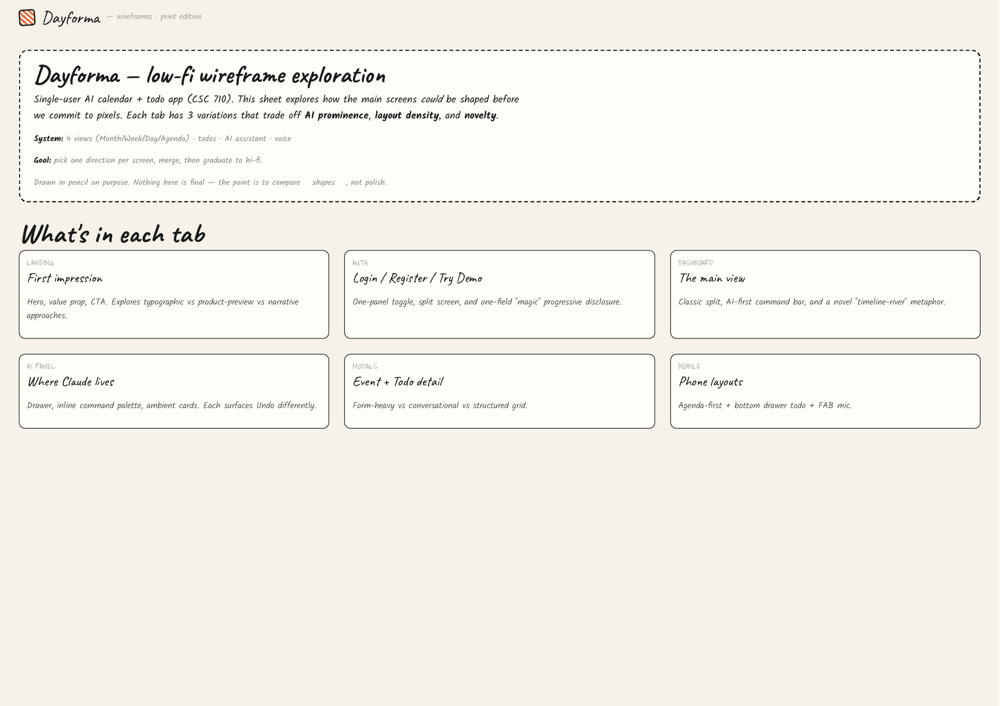
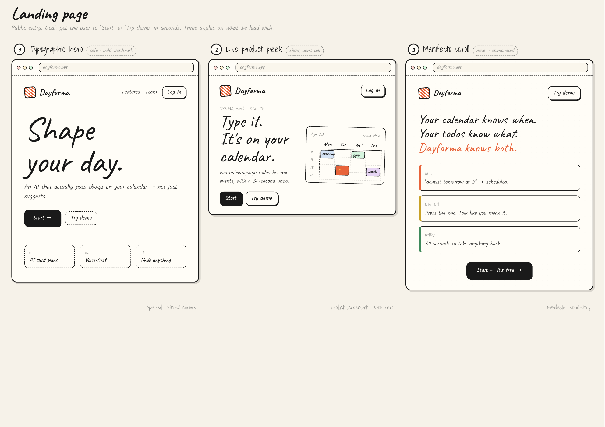
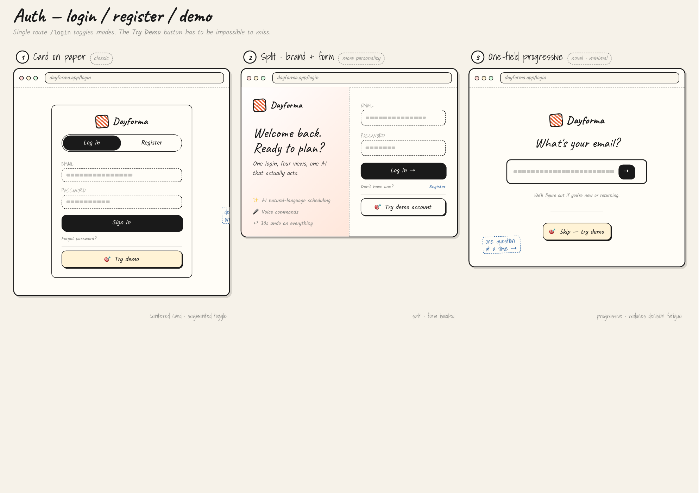
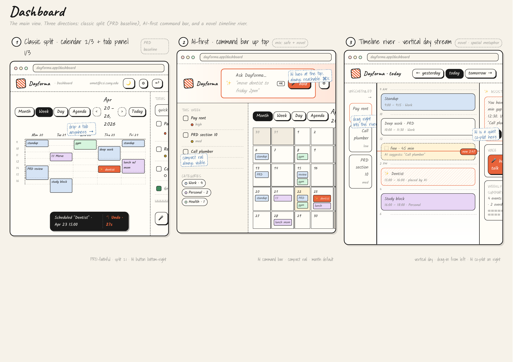
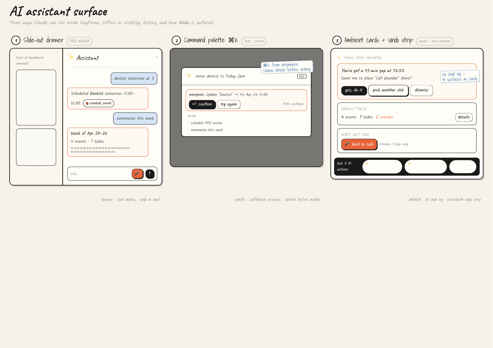
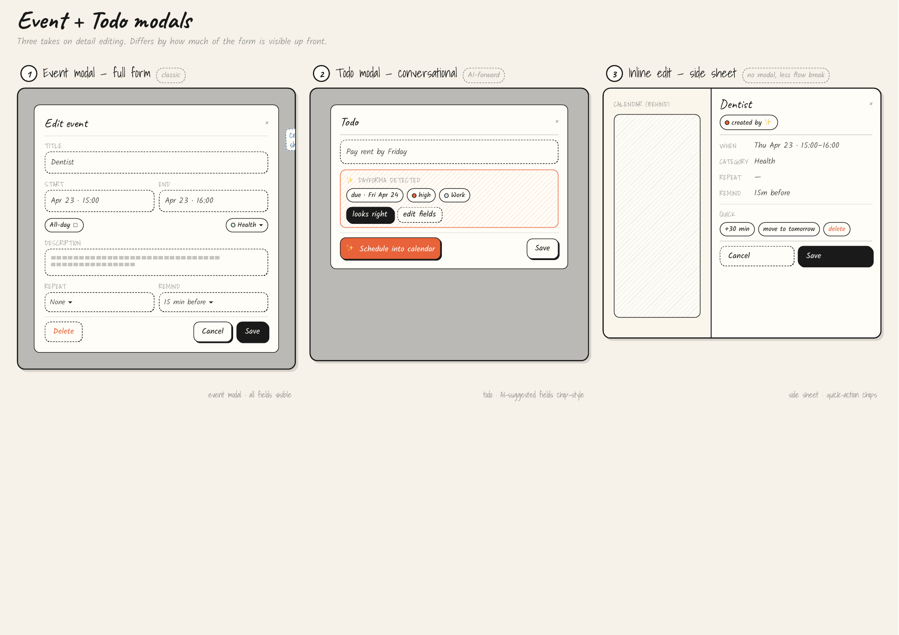
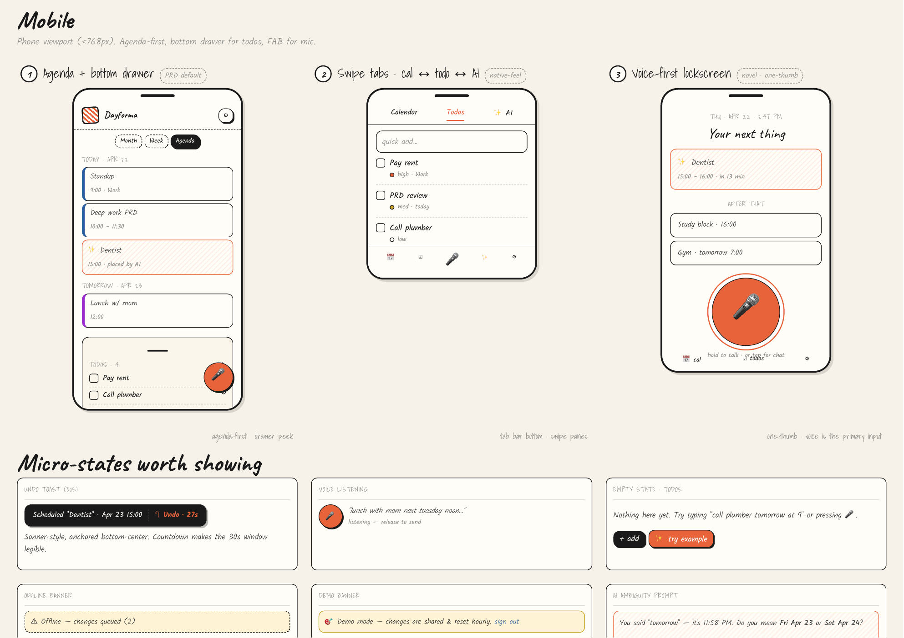

# Dayforma

> AI-powered interactive calendar + todo manager. Shape your day.

**Live demo:** https://umutc.github.io/CSC-710-AI-Calendar/

**Course:** CSC 710 — Software Engineering, CUNY College of Staten Island (Spring 2026)
**Team:** Umut Çelik · Merve Gazi · Justin Huang
**Presentation:** May 13, 2026 · **Submission:** May 20, 2026

---

## What it does

- Multi-view calendar (Month / Week / Day / Agenda) on the left; todo list on the right.
- Natural-language todo entry — type "dentist tomorrow at 3" and the AI assistant creates
  the event for you.
- Drag-drop todos onto the calendar, or hit **Schedule with AI** and let Claude find a free
  block that respects your existing events.
- Category-coloured events with simple recurrence presets (daily / weekly / monthly / weekday).
- Voice control in Chrome/Edge (Web Speech API) — press the mic, speak, and Claude can create,
  move, and summarise events hands-free.
- 30-second Undo toast on every AI action.
- Browser notifications for upcoming events.
- Dark/light theme that follows `prefers-color-scheme` with a manual toggle.
- **Try Demo** button on the login screen loads a pre-seeded account for instant exploration.

## Stack

| Layer | Tech |
| ----- | ---- |
| Frontend | React 18 · Vite 6 · Tailwind v4 · React Router v7 · TypeScript |
| Calendar UI | FullCalendar v6 |
| Forms | react-hook-form + zod |
| State | React Context + useReducer |
| Dates | date-fns v4 |
| Toast | sonner |
| Backend | Supabase (Auth · Postgres · Realtime · Edge Functions) |
| AI | Claude (`claude-sonnet-4-6`) via Supabase Edge Function |
| Voice | Web Speech API (SpeechRecognition + SpeechSynthesis) |
| Testing | Vitest + React Testing Library · Playwright MCP |
| Hosting | GitHub Pages (auto-deploy on push to `main`) |

Full technical design: [`CSC710_Dayforma_Technical_Document.md`](./CSC710_Dayforma_Technical_Document.md).

## Wireframes

Low-fi pencil exploration — three variations per screen (AI prominence × layout density × novelty).
Source PDF: [`docs/Dayforma-Wireframes.pdf`](./docs/Dayforma-Wireframes.pdf).

### Overview


### Landing
Typographic hero · live product peek · manifesto scroll.


### Auth (login / register / demo)
Card · split brand+form · one-field progressive.


### Dashboard
Classic split (PRD baseline) · AI-first command bar · timeline river.


### AI assistant surface
Slide-out drawer · ⌘K command palette · ambient cards + Undo strip.


### Event + Todo modals
Full form · conversational · inline side sheet.


### Mobile
Agenda + bottom drawer · swipe tabs · voice-first lockscreen. Includes micro-states: Undo toast,
voice listening, empty state, offline banner, demo banner, AI ambiguity prompt.


## Quickstart

```bash
nvm use                             # Node 24 (see .nvmrc)
npm install

cp .env.example .env.local
# Fill in VITE_SUPABASE_URL and VITE_SUPABASE_PUBLISHABLE_KEY

supabase link --project-ref <ref>
supabase db push                    # apply the initial schema + RLS
supabase functions deploy ai-assistant

npm run dev                         # http://localhost:5173/CSC-710-AI-Calendar/
```

## Scripts

| Command | Action |
| ------- | ------ |
| `npm run dev` | start Vite dev server |
| `npm run build` | type-check + production build |
| `npm run preview` | serve the production build locally |
| `npm run test` | run Vitest in watch mode |
| `npm run test:run` | run Vitest once (CI) |
| `npm run typecheck` | `tsc --noEmit` |

## Roadmap

See the [GitHub Project board](https://github.com/umutc/CSC-710-AI-Calendar/projects) for the live
sprint breakdown. High-level plan:

1. **Sprint 0** (Apr 22 – 24) — foundations (repo, Supabase, CI)
2. **Sprint 1** (Apr 25 – May 1) — auth, calendar, todos (no AI)
3. **Sprint 2** (May 2 – 8) — Claude Edge Function + NL parse + Undo toast
4. **Sprint 3** (May 9 – 12) — voice, auto-scheduling, polish, E2E tests
5. **May 13** — Presentation
6. **May 14 – 19** — bug fixes + final report
7. **May 20** — submission

## License

Academic project — no license granted for reuse outside CSC 710 coursework.
